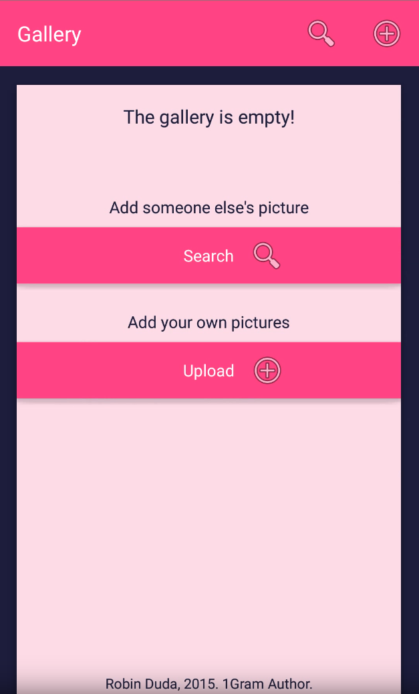

# onegram
NodeJS / Express Server for the Onegram image sharing application. [YouTube demo](https://www.youtube.com/watch?v=86SiHCIcKv0)

<p align="center">
  
</p>

# Features
- authentication
- image repository
- persistent storage with MongoDB

# Running the server
Make sure to install NodeJS and MongoDB.

```console
# 1. start mongodb with
mongod --dbpath "/path/to/db"

# 2. add keypair to certificate/
openssl req -newkey rsa:2048 -nodes -keyout certificates/server.key -x509 -days 365 -out certificates/server.crt

# 3. configure smtp service in bin/mail.js
# 4. start the server

node ./bin/www
```

TBD: configuration simplified.

# Available clients
- [Android](https://github.com/codingchili/onegram-android)
